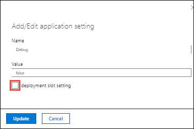

# Module 01: Implementación de aplicaciones web de Azure App Service

https://learn.microsoft.com/es-es/training/paths/create-azure-app-service-web-apps/

## Explorar Azure App Service
Azure App Services: es servicio basado en HTTP, donde podemos alojar aplicaciones web, RestAPI, BackEnd de aplicaciones móviles.

### Escalado de aplicaciones web
Escalado vertical: refiere a la capaciad de aumentar o reducir el numero de nucleos de CPU, la memoria, el espacio en disco, etc.

Escalado horizontal: refiere a la capacidad de aumentar o reducir el numero de instancias que ejecutan la aplicacion web.


### Integracion e implementacion continua
Azure Portal proporciona integracion con varios servicios de control de versiones, como:

* Azure DevOps
* GitHub
* Bitbucket
* FTP
* Local Git repository

### Ranuras de implementacion
Las ranuras de implementacion permiten tener multiples instancias de la aplicacion web, para probar nuevas versiones de la aplicacion, sin afectar la version en produccion.

### App Service en Linux
Azure App Service permite alojar aplicaciones web en Linux(tambien conocidas como WebApp for Container), con soporte para varios lenguajes de programacion, como Node.js, PHP, Python, .NET Core, Ruby, Java, etc.

Es posible consultar la lista de lenguajes soportados mediante el siguiente comando:

```powershell
powershell

az webapp list-runtimes --os-type linux
```

❕ **Nota**: Limitciones de App Service en Linux:

* No se admite en el plan tarifa compartido
* Las imagenes integradas, el codigo y el contenido se asignan a un volumen de almacenamiento para el contenido web, respaldado por Azure Storage. La latencia de disco es mayor y mas variables que la del sistema de archivos del contenedor.

## Examen de los planes de Azure App Service
Cada aplicacion se ejecuta siempre en un App Service Plan(ASP), que define un conjunto de recursos de computo para una aplicacion web. Pueden configurarse una o varias aplicaciones en un mismo ASP, compartiendo los mismos recursos informaticos del plan.

Cuando se crea una plan de App Service, se debe seleccionar el tipo de sistema operativo, el tamaño de la instancia de la maquina virtual, el numero de instancias y el nivel de tarifa.

### Planes de tarifa de Azure App Service
El plan determina que caracteristicas de App Service obtendra y cuanto pagara por el plan. Existen algunos planes de tarifa:

* **Proceso compartido**: Gratis y Compartido, se ejecutan en recursos compartidos con otros usuarios de Azure. No escala horizontalmente.
* **Proceso dedicado**: Básico, Estándar, Premium, PremiumV2 y PremiumV3, las aplicaciones se ejecutan en recursos dedicados, solo las aplicaciones del mismo plan comparten recursos.
* **Aislado**: Aislado y AisladoV2, proporciona aislamiento de red y aislamiento de procesos. Máximas posibilidades de escalabilidad horizontal.

## Implementación en App Service

### Implementacion automatizada
La implementacion automatizada es un proceso que se usa para insertar nuevas caracteristicas y correcciones de errores en un patron repetitivo y rapido con un efecto minimo en los usuarios finales.

Azure admite varios origenes para la implementacion automatizada:
* Azure DevOps Services: inserta el codigo en Azure DevOps Services, compila, ejecuta pruebas, genera una version e inserta el codigo en una aplicacion web de Azure.
* GitHub: directamente desde GitHub. Los cambios que se insertan en la rama de produccion en GitHub se implementan automaticamente.
* Bitbucket: similar a GitHub.

### Implementacion manual
Algunas de las opciones para insertar codigo de manera manual son:

* Git: direccion URL de Git que se puede agregar como repositorio remoto. Al insertar en el repositorio remoto, se implementa la aplicacion.
* Cli: caracteristica de la interfaz de la linea de comandos que empaqueta la aplicacion y la implementa. `az webapp up` puede crear una aplicacion web de App Service de forma automatica si todavia no ha creado una.
* Implementacion desde un archivo Zip: use `curl` o una utilidad HTTP similar para enviar un archivo ZIP de los archivos de la aplicacion a App Service.
* FTP/S: FTP o FTPS es una manera tradicional de insertar el codigo en muchos entornos de hospedaje, incluido App Service.

## Exploración de la autenticación y autorización en App Service
La autenticacion y autorizacion son caracteristicas de App Service que permiten controlar el acceso a las aplicaciones web. Las aplicaciones web pueden requerir autenticacion para acceder a ellas, y pueden requerir autorizacion para acceder a recursos especificos.

### ¿Por qué usar la autenticación integrada?
La autenticacion integrada es una forma sencilla de controlar el acceso a las aplicaciones web. Los marcos web integrados incluyen Azure AD, Facebook, Google y Twitter.

### Funcionamiento
Cuando está habilitado, cada solicitud HTTP entrante pasa a través de él antes de que el código de aplicación lo controle. Este módulo controla varios aspectos de la aplicación:

* Autentica usuarios y clientes con los proveedores de identidades especificados.
* Valida, almacena y actualiza los tokens de OAuth emitidos por los proveedores de identidades configurados.
* Administra la sesión autenticada
* Inserta información de identidad en encabezados de solicitud HTTP.

El módulo se ejecuta por separado del código de la aplicación y se puede configurar mediante Azure Resource Manager o mediante un archivo de configuración. No se necesitan SDK, lenguajes de programación específicos ni cambios en el código de la aplicación.

**Nota**: En Linux y los contenedores, el módulo de autenticación y autorización se ejecuta en un contenedor independiente, aislado del código de la aplicación. Puesto que no se ejecuta en proceso, no es posible la integración directa con plataformas de lenguaje específicas.


### Flujo de autenticación
El flujo de autenticación se inicia cuando un usuario intenta acceder a una aplicación web protegida. El flujo de autenticación se compone de los siguientes pasos:

* El usuario intenta acceder a la aplicación web protegida.
* El módulo de autenticación y autorización redirige al usuario a la página de inicio de sesión del proveedor de identidades.
* El usuario inicia sesión en el proveedor de identidades.
* El proveedor de identidades emite un token de OAuth al módulo de autenticación y autorización.
* El módulo de autenticación y autorización valida el token y, si es válido, permite que el usuario acceda a la aplicación web protegida.

El flujo es el mismo para todos los proveedores, pero varia en funcion de si desea iniciar sesion con el SDK del proveedor o con el SDK de Azure AD.

* Sin SDK del proveedor: la aplicacion delega el inicio de sesion federado a App Service. Por lo general suele ser el caso de las aplicaciones de explorador web, que pueden presentar una pagina de inicio de sesion personalizada, del proveedor al usuario. El usuario inicia sesion en el proveedor y el proveedor redirige al usuario de vuelta a la aplicacion web con un token de acceso.

* Cos SDK del proveedor: La aplicación inica manualmente la sesio del usuario  con el proveedor y luego envía el token de autorización a App Service. Por lo general, suele ser los casos de aplicaciones sin explorar, como API de REST, Azure Functions, los clientes del explorador JavaScript y las aplicaciones móviles nativas. Que no pueden presentar la pagina de inicio del proveedor al usuario.

### Almacén de tokens
App Service proporciona un almacén de tokens integrado, que es un repositorio de tokens que están asociados a los usuarios de las aplicaciones web, API o aplicaciones móviles nativas. Al habilitar la autenticación con cualquier proveedor, este almacén de tokens pasa a estar inmediatamente disponible para la aplicación,

### Registro y seguimiento

Si habilita el registro de aplicaciones, los seguimientos de autenticación y autorización se recopilan directamente en los archivos de registro. Si ve un error de autenticación que no esperaba, puede encontrar cómodamente todos los detalles examinando los registros de aplicaciones existentes.

## Detección de características de redes de App Service
El tráfico de red entrante y saliente de las aplicaciones web de Azure App Service se controla mediante características de red. Las características de red de App Service se dividen en dos implementaciones principales:

* Multi-tenant: muchos clientes diferentes en la misma unidad de escalado. Hospeda planes de App Service en las SKU de precios Gratis, Compartido, Básico, Estándar, Premium, PremiumV2 y PremiumV3.
* Single-Tenant: App Service Environment (ASE) de un único inquilino.

### Características de redes de App Service multiinquilino

Los roles que hospedan la carga de trabajo del cliente se denominan roles de trabajo. Todos los roles de una implementación de App Service existen en una red de varios inquilinos. Puesto que hay muchos clientes diferentes en la misma unidad de escalado de App Service, no puede conectar la red de App Service directamente a su red.

En lugar de conectarse a redes, necesita características para administrar los diversos aspectos de la comunicación de aplicaciones.

| Características de entrada | Características de salida |
| -------------------------- | ------------------------- |
| Dirección asignada a las aplicaciones | conexiones híbridas |
| Restricciones de acceso | Integración de red virtual con requisito de puerta de enlace |
| Puntos de conexión del servicio | Integración de la red virtual |
| Puntos de conexión privados |  |


Puede combinar las características para solucionar los problemas con algunas excepciones. Los siguientes casos de uso de entrada son ejemplos de cómo usar características de redes de App Service para controlar el tráfico de entrada a la aplicación.

| Caso de uso de entrada | Característica |
| ---------------------- | -------------- |
| Compatibilidad con las necesidades de SSL basado en IP de la aplicación | Dirección asignada a las aplicaciones |
| Compatibilidad con la dirección entrante dedicada no compartida para la aplicación | Dirección asignada a las aplicaciones |
| Restricción del acceso a la aplicación desde un conjunto de direcciones bien definidas | Restricciones de acceso |


## Ejercicio: Creación de una aplicación web HTML estática mediante Azure Cloud Shell

https://learn.microsoft.com/es-es/training/modules/introduction-to-azure-app-service/7-create-html-web-app


# Configurar aplicaciones web

## Configuración de la aplicación

En App Service, las configuraciones de aplicaciones son variables que se pasan como variables de entorno al código de la aplicación. En el caso de las aplicaciones Linux y de los contenedores personalizados, App Service pasa la configuración de la aplicación al contenedor mediante la marca --env para establecer la variable de entorno en el contenedor.

Para acceder a la configuración de la aplicación, vaya a la página de administración de la aplicación y seleccione Configuración > Configuración de la aplicación.


Para los desarrolladores de ASP.NET y ASP.NET Core, la configuración de las opciones de aplicación en App Service es como configurarlas en <appSettings> en Web.config o appsettings.json, pero los valores de App Service reemplazan a los de Web.config o appsettings.json. Puede mantener la configuración de desarrollo (por ejemplo, la contraseña de MySQL local) de Web.config o appsettings.json y los secretos de producción (por ejemplo, la contraseña de base de datos de Azure MySQL) de forma segura en App Service. El mismo código usa la configuración de desarrollo cuando se depura localmente, y utiliza los secretos de producción cuando se implementa en Azure.

La configuración de la aplicación siempre se cifra cuando se almacena (cifrado en reposo).

## Adición y edición de la configuración
Para agregar una nueva configuración de aplicación, seleccione Nueva configuración de la aplicación. Si usa ranuras de implementación, puede especificar si la configuración se puede intercambiar o no. En el cuadro de diálogo, puede fijar la configuración a la ranura actual.



Para editar una configuración, seleccione el botón Editar situado a la derecha.

Cuando haya terminado, seleccione Actualizar. No olvide volver a seleccionar Guardar en la página Configuración.


## Edición masiva de la configuración de la aplicación

Para agregar o editar la configuración de la aplicación de forma masiva, haga clic en el botón Avanzado. Cuando haya terminado, seleccione Actualizar. La configuración de la aplicación tiene el formato JSON siguiente:

```json
json


[
  {
    "name": "<key-1>",
    "value": "<value-1>",
    "slotSetting": false
  },
  {
    "name": "<key-2>",
    "value": "<value-2>",
    "slotSetting": false
  },
  ...
]
```

## Configurar cadenas de conexión

Para los desarrolladores de ASP.NET y ASP.NET Core, los valores establecidos en App Service invalidan los de Web.config. Para otras pilas de lenguaje, es mejor usar la configuración de la aplicación en su lugar, ya que las cadenas de conexión requieren un formato especial en las claves de variable para poder acceder a los valores. Las cadenas de conexión siempre se cifran cuando se almacenan (cifrado en reposo).

La adición y edición de cadenas de conexión sigue los mismos principios que otras configuraciones de la aplicación y también se puede vincular a ranuras de implementación. Un ejemplo de cadenas de conexión en formato JSON que se usaría para la adición o edición de forma masiva.

```json
json

[
  {
    "name": "name-1",
    "value": "conn-string-1",
    "type": "SQLServer",
    "slotSetting": false
  },
  {
    "name": "name-2",
    "value": "conn-string-2",
    "type": "PostgreSQL",
    "slotSetting": false
  },
  ...
]
```

## Configurar las opciones generales

En la sección Configuración > Configuración general, puede configurar algunas opciones comunes de la aplicación. Algunas configuraciones requieren escalar verticalmente hasta los planes de tarifa superiores.

Una lista de las opciones disponibles actualmente:

* Configuración de pila: La pila de software para ejecutar la aplicación, incluidos el lenguaje y las versiones del SDK. Para aplicaciones de Linux y aplicaciones de contenedor personalizadas, también puede establecer un archivo o un comando de inicio opcional.


* Configuración de plataforma: Le permite configurar opciones para la plataforma de alojamiento, incluidas:

* Valor de bits: 32 bits o 64 bits.

* Protocolo de WebSocket: para ASP.NET SignalR o socket.io, por ejemplo.

* Always On: mantenga cargada la aplicación, incluso cuando no hay tráfico. De forma predeterminada, Always On no está habilitado y la aplicación se descarga después de 20 minutos sin ninguna solicitud entrante. Esto es necesario en los WebJobs continuos o WebJobs que se desencadenan mediante una expresión CRON.

* Versión de canalización administrada: el modo de canalización de IIS. Establézcalo en Clásico si tiene una aplicación heredada que requiere una versión anterior de IIS.

* Versión de HTTP: Establézcala en 2.0 para habilitar la compatibilidad con el protocolo HTTP/2.

* Afinidad ARR: en una implementación de varias instancias, asegúrese de que el cliente esté enrutado a la misma instancia de la vida de la sesión. Puede establecer esta opción en Desactivada para las aplicaciones sin estado.

* Depuración: habilite la depuración remota para las aplicaciones de ASP.NET, ASP.NET Core o Node.js. Esta opción se desactiva automáticamente después de 48 horas.

* Certificados de cliente entrantes: requieren certificados de cliente en la autenticación mutua. La autenticación mutua TLS se usa para restringir el acceso a la aplicación mediante la habilitación de diferentes tipos de autenticación.


## Configurar asignaciones de ruta de acceso

Las asignaciones de ruta de acceso permiten a las aplicaciones web de Azure App Service servir contenido desde un sistema de archivos compartido. Las asignaciones de ruta de acceso se pueden configurar en la página Configuración > Asignaciones de ruta de acceso.


La página Asignaciones de ruta de acceso muestra distintas opciones según el tipo de sistema operativo.

### Aplicaciones de Windows (sin contenedor)

Para las aplicaciones de Windows (sin contenedor), puede configurar las asignaciones de ruta de acceso para las carpetas de la aplicación y las carpetas de carga. Las carpetas de la aplicación son de solo lectura y se pueden usar para almacenar contenido estático, como imágenes, CSS y JavaScript. Las carpetas de carga son de lectura y escritura y se pueden usar para almacenar contenido dinámico, como archivos cargados por los usuarios.

### Aplicaciones de Linux y aplicaciones de contenedor

También puede agregar almacenamiento personalizado para la aplicación en contenedor. Las aplicaciones en contenedores incluyen todas las aplicaciones de Linux y también los contenedores personalizados de Windows y Linux que se ejecutan en App Service. Seleccione Nuevo montaje de Azure Storage y configure el almacenamiento personalizado de la manera siguiente:

* Name: El nombre para mostrar.
* Opciones de configuración: básica o avanzada.
* Cuentas de almacenamiento: cuenta de almacenamiento con el contenedor que quiere.
* Storage type (Tipo de almacenamiento): Azure Blobs o Azure Files Las aplicaciones de contenedor de Windows solo admiten Azure Files.
* Contenedor de almacenamiento: para la configuración básica, el contenedor que quiera.
* Nombre del recurso compartido: para la configuración avanzada, el nombre del recurso compartido.
* Clave de acceso: para la configuración avanzada, la clave de acceso.
* Ruta de acceso de montaje: La ruta de acceso absoluta en el contenedor para montar el almacenamiento personalizado.

## Activación del registro de diagnóstico

Hay diagnósticos integrados que ayudan a depurar una aplicación de App Service. En esta lección, aprenderá a habilitar el registro de diagnóstico y a agregar instrumentación a la aplicación, y verá cómo acceder a la información que registra Azure.

En la tabla siguiente se muestran los tipos de registro, las plataformas admitidas y dónde se pueden almacenar y localizar los registros para acceder a la información.

| Tipo | Plataforma | Location | Descripción |
| ---- | ---------- | -------- | ----------- |
| Registro de aplicaciones | Windows, Linux | Sistema de archivos de App Service o blobs de Azure Storage | Registra los mensajes generados por el código de aplicación. Los mensajes se generan en el marco web que elija o directamente desde el código de aplicación mediante el patrón de registro estándar del lenguaje. A cada mensaje se le asigna una de las siguientes categorías: Crítico, Error, Advertencia, Información, Depuración y Seguimiento. |
| Registro del servidor web | Windows | Sistema de archivos de App Service o blobs de Azure Storage | Datos de solicitud HTTP sin procesar en el formato de archivo de registro extendido W3C. Cada mensaje de registro incluye datos como el método HTTP, el URI de recurso, la dirección IP del cliente, el puerto de cliente, el agente de usuario, el código de respuesta, etc. |
| Registro de errores detallado | Windows | Sistema de archivos de App Service | Copias de las páginas de error .html que se habrían enviado al explorador del cliente. Por motivos de seguridad, no se deben enviar páginas de error detalladas a los clientes en producción, pero App Service puede guardar la página de error cada vez que se produzca un error de aplicación que tenga el código HTTP 400 o superior. |
| Seguimiento de solicitudes con error | Windows | Sistema de archivos de App Service | Información de seguimiento detallada sobre las solicitudes con error, lo que incluye un seguimiento de los componentes de IIS usados para procesar la solicitud y el tiempo dedicado a cada componente. Se genera una carpeta para cada solicitud con error, que contiene el archivo de registro XML y la hoja de estilos XSL con la que ver el archivo de registro. |
| Registro de implementación | Windows, Linux | Sistema de archivos de App Service | Ayuda a determinar por qué se ha producido un error en la implementación. El registro de implementación tiene lugar automáticamente, no hay valores configurables. |

## Habilitación del registro de aplicaciones (Windows)

Para habilitar el registro de aplicaciones, vaya a la página de administración de la aplicación y seleccione Registro de diagnóstico. En la página Registro de diagnóstico, seleccione Habilitar registro de aplicaciones.

| Nivel | Categorías incluidas |
| ----- | -------------------- |
| Deshabilitada | None |
| Error | Error, Crítico |
| Warning (ADVERTENCIA) | Advertencia, Error, Crítico |
| Información | Información, Advertencia, Error, Crítico |
| Detallado | Seguimiento, Depurar, Información, Advertencia, Error, Crítico (todas las categorías) |

## Habilitación del registro de aplicaciones (Linux o Contenedor)

1. En Registros de App Service, establezca la opción Registro de la aplicación en Sistema de archivos.

2. En Cuota (MB) , especifique la cuota de disco para los registros de aplicaciones. En Período de retención (días) , establezca el número de días que se deben conservar los registros.

3. Cuando termine, seleccione Guardar.

## Habilitar el registro de servidor web

1. Para el registro de servidor web, seleccione Almacenamiento para almacenar los registros en Blob Storage, o Sistema de archivos para almacenar los registros en el sistema de archivos de App Service.

2. En Período de retención (días) , establezca el número de días que se deben conservar los registros.

3. Cuando termine, seleccione Guardar.

## Adición de mensajes de registro en el código

Para las aplicaciones ASP.NET puede usar la clase de seguimiento para registrar mensajes en el registro de aplicaciones. En el código de la aplicación,


- Trace.TraceError("Message"); *// Escribe un mensaje de error*
- Trace.TraceWarning("Message"); *// Escribe un mensaje de advertencia*
- Trace.TraceInformation("Message"); *// Escribe un mensaje de carácter informativo*
- Trace.WriteLine("Message"); *// Escribe un mensaje detallado*

```C#
C#
System.Diagnostics.Trace.TraceError("If you're seeing this, something bad happened");
```

### Aplicaciones ASP.NET Core

se pueden ejecutar tanto en Windows como en Linux. Para registrar información en los registros de la aplicación de Azure, use la clase **LoggerFactory** y, después, use uno de los seis niveles de registro disponibles:

- logger.LogCritical("Mensaje"); *// Escribe un mensaje crítico en el nivel de registro 5*
- logger.LogError("Mensaje"); *// Escribe un mensaje de error en el nivel de registro 4*
- logger.LogWarning("Mensaje"); *// Escribe un mensaje de advertencia en el nivel de registro 3*
- logger.LogInformation("Mensaje"); *// Escribe un mensaje de carácter informativo en el nivel de registro 2*
- logger.LogDebug("Message"); *// Escribe un mensaje de depuración en el nivel de registro 1*
- logger.LogTrace("Mensaje"); *// Escribe un mensaje de seguimiento detallado en el nivel de registro 0*

En el caso de las aplicaciones ASP.NET Core en Windows, estos mensajes se relacionan con los filtros de Azure Portal del siguiente modo:

- Los niveles 4 y 5 son mensajes de "error".
- El nivel 3 es un mensaje de "advertencia".
- El nivel 2 es un mensaje de "carácter informativo".
- Los niveles 0 y 1 son mensajes "detallados".

En cuanto a las aplicaciones ASP.NET Core en Linux, solo se registran los mensajes de "error" (es decir, los niveles 4 y 5).

## **Aplicaciones Node.js**

aplicaciones web basadas en scripts, como las aplicaciones Node.js en Windows o Linux, el registro de aplicaciones se habilita con el método **console()**:

- console.error("Message"): escribe un mensaje en STDERR
- console.log("Message"): escribe un mensaje en STDOUT

Ambos tipos de mensaje se escriben en los registros de nivel de error de Azure App Service.
Las aplicaciones de Python pueden usar el paquete OpenCensus para enviar registros al registro de diagnóstico de la aplicación.

## Acceso a los archivos de registro

Si configura la opción de blobs de Azure Storage para un tipo de registro, necesitará una herramienta de cliente que funcione con Azure Storage.

En el caso de los registros almacenados en el sistema de archivos de App Service, la manera más fácil es descargar el archivo ZIP en el explorador en:

* Aplicaciones Linux o de contenedor: https://<app-name>.scm.azurewebsites.net/api/logs/docker/zip
* Aplicaciones Windows: https://<app-name>.scm.azurewebsites.net/api/dump

En el caso de las aplicaciones Linux o de contenedor, el archivo ZIP contiene registros de salida de la consola para el host de Docker y el contenedor de Docker. En el caso de las aplicaciones escaladas horizontalmente, el archivo ZIP contiene un conjunto de registros para cada instancia. En el sistema de archivos de App Service, estos archivos de registro son el contenido del directorio /home/LogFiles.

## Configuración de certificados de seguridad

Azure App Service tiene herramientas que le permiten crear, cargar o importar un certificado privado o un certificado público en App Service.

Los certificados cargados en una aplicación se almacenan en una unidad de implementación enlazada a la combinación de región y grupo de recursos del plan de App Service (que internamente se denomina espacio web). De esta manera, los certificados son accesible para otras aplicaciones de la misma combinación de región y grupo de recursos.

En la tabla siguiente se detallan las opciones que tiene para agregar certificados en App Service:

| Opción | Descripción |
| ------ | ----------- |
| Crear un certificado administrado de App Service gratuito | Certificado privado que es gratuito y fácil de usar si solo necesita proteger el dominio personalizado en App Service. |
| Compra de un certificado de App Service | Es un certificado privado administrado por Azure. Combina la simplicidad de la administración automatizada de certificados con la flexibilidad de las opciones de renovación y exportación. |
| Importación de un certificado de Key Vault | Resulta útil si usa Azure Key Vault para administrar los certificados. |
| Carga de un certificado privado | Si ya tiene un certificado privado de un proveedor de terceros, puede cargarlo. |
| Carga de un certificado público | Los certificados públicos no se usan para proteger los dominios personalizados, pero se pueden cargar en el código si los necesita para acceder a los recursos remotos. |

# Escalado de aplicaciones en Azure App Service

## Examen de los factores de escalado automático

El escalado automático se puede activar en función de una programación o evaluando si el sistema se ejecuta con recursos insuficientes.

## ¿Qué es el escalado automático?

El escalado automático es un proceso que ajusta el número de instancias de una aplicación web en función de la carga de trabajo. El escalado automático puede ser horizontal o vertical.

## Escalado automático de Azure App Service

En Azure App Service, el escalado automático supervisa las métricas de recursos de una aplicación web mientras se ejecuta. Detecta situaciones en las que se necesitan otros recursos para controlar un aumento de la carga de trabajo, y garantiza que esos recursos estén disponibles antes de que el sistema se sobrecargue.

El escalado automático responde a los cambios en el entorno mediante la adición o eliminación de servidores web, y el equilibrio de la carga entre ellos. El escalado automático no tiene ningún efecto en la potencia de la CPU, la memora ni la capacidad de almacenamiento de los servidores web que alimentan la aplicación; solo cambia el número de servidores web.

## Reglas de escalado automático

El escalado automático toma sus decisiones en función de las reglas que se definan. Una regla especifica el umbral para una métrica y desencadena un evento de escalabilidad automática cuando se sobrepasa este umbral. El escalado automático también puede desasignar los recursos cuando la carga de trabajo disminuye.

El escalado automático mejora la disponibilidad y la tolerancia a errores. Puede ayudar a garantizar que las solicitudes cliente a un servicio no se denieguen porque una instancia no sea capaz de reconocer la solicitud de manera oportuna, o bien porque una instancia sobrecargada se haya bloqueado.

## Condiciones de la escalabilidad automática

Para indicar cómo realizar la escalabilidad automática, se crean condiciones de escalabilidad automática. Azure ofrece dos opciones para el escalado automático:

* Escalado basado en una métrica, como la longitud de cola de disco o el número de solicitudes  HTTP en espera de procesamiento.

* Escalado a un número específico de instancias según una programación Por ejemplo, puede organizar la operación de escalar horizontalmente a una hora concreta del día, una fecha específica o un día de la semana. También se especifica una fecha de finalización y el sistema se vuelve a escalar en ese momento.

## Métricas para las reglas de escalabilidad automática

Algunas métricas clave para determinar cuándo escalar son:

1. Porcentaje de CPU: Indica cuánta capacidad de procesamiento está utilizando la CPU en todas las instancias. Si es alto, puede haber retrasos en el procesamiento de solicitudes de clientes.

2. Porcentaje de memoria: Mide la ocupación de la memoria en todas las instancias. Un valor alto indica que la memoria libre se está agotando, lo que podría provocar errores.

3. Longitud de cola de disco: Refleja el número de solicitudes de E/S pendientes en todas las instancias. Si es largo, podría haber contención en el acceso al almacenamiento.

4. Longitud de la cola HTTP: Muestra cuántas solicitudes de clientes están esperando procesamiento por parte de la aplicación web. Si es alta, los clientes pueden experimentar errores HTTP 408 (tiempo de espera).

5. Entrada y salida de datos: Representan la cantidad de bytes recibidos y enviados desde todas las instancias.

Cada métrica tiene su propio intervalo de agregación intrínseco, pero en la mayoría de los casos este período es de 1 minuto. El valor agregado se conoce como agregación de tiempo. Las opciones disponibles son Media, Mínimo, Máximo, Suma, Último y Recuento.

# Exploración de ranuras de implementación de Azure App Service

La funcionalidad de ranura de implementación de App Service es una herramienta eficaz que le permite administrar, probar, implementar y obtener una vista previa de los distintos entornos de desarrollo.
