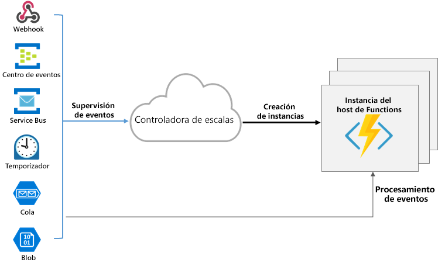

# Module 02: Implementando Azure Functions

https://learn.microsoft.com/es-es/training/paths/implement-azure-functions/

## Azure Function
Azure Functions es una solución sin servidor que le permite escribir menos código, mantener menos infraestructura y ahorrar costos. En lugar de preocuparse por implementar y mantener servidores, la infraestructura en la nube proporciona todos los recursos actualizados necesarios para mantener las aplicaciones en ejecución.

Azure Functions admite desencadenadores que son formas de iniciar la ejecución del código, y enlaces que son formas de simplificar la codificación para los datos de entrada y salida.

### Comparativa entre Functions y WebJobs
Al igual que Azure Functions, Azure App Service WebJobs con el SDK de WebJobs es un servicio de integración de tipo código primero que está diseñado para desarrolladores. Ambos se basan en Azure App Service y admiten características como la integración del control de código fuente, la autenticación y la supervisión con integración de Application Insights.

Azure Functions se basa en el SDK de WebJobs, por lo que comparte muchos desencadenadores de eventos y conexiones con otros servicios de Azure. Estos son algunos de los factores que se deben tener en cuenta al elegir entre Azure Functions y WebJobs con el SDK de WebJobs:

| Funciones | WebJobs con el SDK de WebJobs |
| --- | --- |
| Modelo de aplicaciones sin servidor con escalado automático | Sí |
| Desarrollo y pruebas en el explorador | Sí |
| Precio de pago por uso | Sí |
| Integración con Logic Apps | Sí |
| Desencadenar eventos | Temporizador<br>Blobs y colas de Azure Storage<br>Colas y temas de Azure Service Bus<br>Azure Cosmos DB<br>Azure Event Hubs<br>HTTP/WebHook (GitHub, Slack)<br>Azure Event Grid |
| Sistema de archivos | Temporizador<br>Blobs y colas de Azure Storage<br>Colas y temas de Azure Service Bus<br>Azure Cosmos DB<br>Azure Event Hubs<br>Sistema de archivos |

### Comparación de las opciones de hospedaje de Azure Functions

Cuando crea una aplicación de funciones en Azure, debe elegir un plan de hospedaje para su aplicación. Hay tres planes de hospedaje básico disponibles para Azure Functions: Plan de consumo, plan Premium y plan App Service (Dedicado). Todos los planes de hospedaje tienen disponibilidad general (GA) en máquinas virtuales Linux y Windows.

Ventajas de los tres planes de hospedaje principales de Functions:

| Plan | Ventajas |
| --- | --- |
| Plan de consumo | Este es el plan de hospedaje predeterminado. Escala de forma automática y pagará los recursos de proceso solo cuando se ejecuten las funciones. Las instancias del host de Functions se agregan y quitan de forma dinámica según el número de eventos entrantes. |
| Plan Premium | Escala automáticamente en función de la demanda mediante trabajos preparados previamente que ejecutan aplicaciones sin ningún retraso después de estar inactivas, ejecuta en instancias más eficaces y se conecta a redes virtuales. |
| Plan dedicado | Ejecute sus funciones en un plan de App Service con las tarifas de plan de App Service normal. Mejor para escenarios de ejecución prolongada en los que no se puede usar Durable Functions. |

Hay otras dos opciones de hospedaje que proporcionan el mayor control y aislamiento posibles con los que ejecutar las aplicaciones de funciones.

| Opción de hospedaje | Detalles |
| --- | --- |
| Azure App Service Environment | App Service Environment (ASE) es una característica de App Service que proporciona un entorno completamente aislado y dedicado para ejecutar de forma segura las aplicaciones de App Service a gran escala. |
| Kubernetes (Directo o Azure Arc) | Kubernetes proporciona un entorno completamente aislado y dedicado que se ejecuta sobre la plataforma de Kubernetes. |


### Planes de hospedaje y escalado

Se comparan los comportamientos de escalado de los distintos planes de hospedaje. El número máximo de instancias se da en función de una aplicación por función (consumo) o por plan (Premium/Dedicado), a menos que se indique lo contrario.

| Opción de hospedaje | Escalado horizontal | N.º máximo de instancias |
| --- | --- | --- |
| Plan de consumo | Basado en eventos. Escale horizontalmente de forma automática, incluso durante períodos de gran carga. La infraestructura de Azure Functions escala los recursos de CPU y memoria mediante la incorporación de más instancias del host de Functions, según el número de eventos de desencadenador entrantes. | Windows: 200, Linux: 100 |
| Plan Premium | Basado en eventos. Escale horizontalmente de forma automática, incluso durante períodos de gran carga. La infraestructura de Azure Functions escala automáticamente los recursos de CPU y la memoria mediante la incorporación de más instancias del host de Functions, según el número de eventos desencadenados por las funciones. | Windows: 100, Linux: 20-100 |
| Plan dedicado | Escalabilidad automática o manual | 10-20 |
| Azure App Service Environment | Escalabilidad automática o manual | 100 |
| Kubernetes | Escalado automático basado en eventos para los clústeres de Kubernetes mediante KEDA. | Varía en función del clúster |


### Duración del tiempo de espera de una aplicación de función

La propiedad ```functionTimeout``` del archivo del proyecto host.json especifica la duración del tiempo de espera de las funciones de una aplicación de funciones. Esta propiedad se aplica específicamente a las ejecuciones de funciones. Una vez que el desencadenador inicia la ejecución de la función, la función debe devolver o responder dentro de la duración del tiempo de espera.


Por defecto es de 5 minutos, y como máximo puede definirse 10 minutos. Esta propiedad se define en el archivo host.json.
El tiempo puede ser mayor en planes Premium y Dedicados donde por defecto tienen definido 302 minutos.

Valores predeterminados y máximos (en minutos) para planes específicos:

| Plan | Valor predeterminado | Máximo |
| --- | --- | --- |
| Plan de consumo | 5 | 10 |
| Plan Premium | 30 | Sin límite |
| Plan dedicado | 30 | Sin límite |


### Requisitos de la cuenta de almacenamiento

En cualquier plan, una aplicación de funciones requiere una cuenta de Azure Storage general que admita almacenamiento de Azure en blobs, colas, archivos y tablas. Esto es porque Functions se basa en Azure Storage para operaciones como la administración de desencadenadores y el registro de las ejecuciones de funciones, pero algunas cuentas de almacenamiento no admiten colas ni tablas.

Los desencadenadores y enlaces para almacenar los datos de la aplicación también pueden usar la misma cuenta de almacenamiento que usa la aplicación de función. Sin embargo, para las operaciones que consumen muchos recursos de almacenamiento, debe usar una cuenta de almacenamiento independiente.

### Escalado de Azure Functions

En los planes Consumo y Premium, Azure Functions escala los recursos de CPU y memoria mediante la incorporación de instancias adicionales del host de Functions.

Cada instancia del host de Functions del plan de consumo tiene una limitación de 1.5 GB de memoria y una CPU. Una instancia del host es la aplicación de funciones completa, lo que significa que todas las funciones de una aplicación de funciones comparten recursos al mismo tiempo en una instancia y escala determinadas. Las aplicaciones de funciones que comparten el mismo plan de consumo se escalan de manera independiente.

Los archivos de código de función se almacenan en recursos compartidos de Azure Files en la cuenta de almacenamiento principal de la función. Al eliminarse la cuenta de almacenamiento principal de la aplicación de función, los archivos de código de función también se eliminan y no se pueden recuperar.


### Escalado del entorno de tiempo de ejecución

Azure Functions usa un componente denominado controlador de escala para supervisar la tasa de eventos y determinar si se debe escalar o reducir horizontalmente. El controlador de escala usa la heurística para cada tipo de desencadenador. Por ejemplo, al usar un desencadenador de Azure Queue Storage, se escala en función de la longitud de la cola y la antigüedad del mensaje más antiguo de la cola.

La unidad de escala de Azure Functions es la aplicación de funciones. Al escalar horizontalmente la aplicación de función, se asignan más recursos para ejecutar varias instancias del host de Azure Functions. Por el contrario, si la demanda se reduce, el controlador de escala elimina instancias del host de la función. El número de instancias se "reduce horizontalmente" hasta cero cuando no se ejecuta ninguna función en la aplicación de funciones.



 Nota

Una vez que la aplicación de funciones ha estado inactiva durante varios minutos, la plataforma puede escalar el número de instancias en las que la aplicación se ejecuta hasta cero. La siguiente solicitud tiene la latencia agregada al escalar de cero a uno. Esta latencia se conoce como arranque en frío.


### Comportamientos de escalado

El escalado puede variar en función de muchos factores y realizarse de forma diferente según el desencadenador y el lenguaje seleccionados. Hay algunas complejidades de los comportamientos del escalado que hay que tener en cuenta:

**Número máximo de instancias**: Una aplicación de funciones única solo se escala horizontalmente hasta un máximo de 200 instancias. Una única instancia puede procesar más de un mensaje o solicitud a la vez, por lo que no hay un límite establecido en el número de ejecuciones simultáneas.

**Nueva tasa de instancias**: En el caso de los desencadenadores HTTP, solo se asignan nuevas instancias como máximo una vez cada segundo. Para los desencadenadores que no son HTTP, solo se asignan nuevas instancias como máximo una vez cada 30 segundos.

### Límite de escalabilidad horizontal

Es posible que quiera restringir el número máximo de instancias que una aplicación usa para realizar el escalado horizontal. Esto es más común en los casos en los que un componente de nivel inferior, como una base de datos, tiene un rendimiento limitado. De forma predeterminada, las funciones del plan de Consumo se escalan horizontalmente hasta 200 instancias y las funciones del plan Premium se escalan horizontalmente hasta 100 instancias. Puede especificar un máximo inferior para una aplicación específica modificando el valor ```functionAppScaleLimit```. ```functionAppScaleLimit``` se puede establecer en 0 o null para indicar que no hay restricciones, o en un valor válido entre 1 y el máximo de la aplicación.


## Desarrollo de Azure Functions

### Exploración del desarrollo de Azure Functions

Una función contiene dos elementos importantes: 

    * **el código**, que se puede escribir en diversos lenguajes, 
    * **y la configuración**, el archivo function.json.
    
Con los lenguajes compilados, este archivo de configuración se genera automáticamente a partir de las anotaciones del código. Para los lenguajes de scripting, debe proporcionar el archivo de configuración.

El archivo function.json define el desencadenador de la función, los enlaces y otras opciones de configuración. 

Cada función tiene un solo desencadenador. Este archivo de configuración se usa en tiempo de ejecución para determinar los eventos que se supervisarán y cómo pasar datos y devolverlos al ejecutarse una función. 

Ejemplo de archivo function.json.

```JSON

{
    "disabled":false,
    "bindings":[
        // ... bindings here
        {
            "type": "bindingType",
            "direction": "in",
            "name": "myParamName",
            // ... more depending on binding
        }
    ]
}
```

La propiedad **bindings** es donde configura los enlaces y los desencadenadores. Cada enlace comparte unos ajustes de configuración comunes y algunos parámetros que son específicos de un determinado tipo de enlace. 


Cada enlace requiere la siguiente configuración:

| Propiedad | Tipos | Comentarios |
| --- | --- | --- |
| type | string | Nombre del enlace. Por ejemplo, queueTrigger. |
| direction | string | Indica si el enlace está disponible para recibir datos en la función o enviar datos de la función. Por ejemplo, in o out. |
| name | string | El nombre que se usa para los datos enlazados en la función. Por ejemplo, myQueue. |

### Aplicación de función

La aplicación de función proporciona un contexto de ejecución en Azure donde ejecutar las funciones. Como tal, es la unidad de implementación y administración de las funciones. Una aplicación de función se compone de una o varias funciones individuales que se administran, implementan y escalan conjuntamente. Todas las funciones de una aplicación de función comparten el mismo plan de precios, el mismo método de implementación y la misma versión en tiempo de ejecución. Una aplicación de función es como una forma de organizar y administrar las funciones de manera colectiva.

```Nota

En Functions 2.x, todas las funciones de una aplicación de funciones deben crearse en el mismo lenguaje. En versiones anteriores del tiempo de ejecución de Azure Functions, esto no era necesario.
Estructura de carpetas```


El código de todas las funciones de una aplicación de funciones está ubicado en una carpeta de proyecto raíz que contiene un archivo de configuración de host. 

El archivo host.json contiene configuraciones específicas del entorno de ejecución y está en la carpeta raíz de la aplicación de funciones. 

Un carpeta bin contiene paquetes y otros archivos de biblioteca que requiere la aplicación de funciones. Las estructuras de carpeta específicas necesarias para la aplicación de funciones dependen del lenguaje:

    * Compilado en C# (.csproj)
    * Script de C# (.csx)
    * Script de F#
    * Java
    * JavaScript
    * Python


### Entornos de desarrollo locales

Azure Functions le permite usar el editor de código y las herramientas de desarrollo que prefiera para crear y probar sus funciones en un equipo local. Las funciones locales pueden conectarse a servicios de Azure en directo, y puede depurar sus funciones en el equipo local con el entorno de tiempo de ejecución de Functions completo.

```Advertencia

No mezcle el desarrollo local con el desarrollo del portal en la misma aplicación de función. Cuando cree y publique funciones desde un proyecto local, no debe intentar mantener o modificar el código del proyecto en el portal.
```


### Creación de desencadenadores y enlaces

Los **desencadenadores** provocan la ejecución de una función. Un desencadenador define cómo se invoca una función y cada función debe tener exactamente un desencadenador. Los desencadenadores tienen datos asociados, que a menudo son la carga de la función.

El **enlace** a una función es una manera de conectar otro recurso a la función mediante declaración. Los enlaces pueden estar conectados como enlaces de entrada, enlaces de salida o ambos. Los datos de los enlaces se proporcionan a la función como parámetros.

Puede mezclar y asignar enlaces diferentes para satisfacer sus necesidades. Los enlaces son opcionales y cada función puede tener uno o varios enlaces de entrada y de salida.

Los desencadenadores y enlaces evitan codificar el acceso a otros servicios. La función recibe los datos (por ejemplo, el contenido de un mensaje de cola) en parámetros de función. El usuario envía datos (por ejemplo, para crear un mensaje de la cola) mediante el valor devuelto de la función.

### Definiciones de desencadenador y enlace

Los desencadenadores y enlaces se definen de forma diferente en función del lenguaje de desarrollo.

| Idioma | Los desencadenadores y enlaces se configuran por... |
| --- | --- |
| Biblioteca de clases de C# | la decoración de métodos y parámetros con atributos de C# |
| Java | la decoración de métodos y parámetros con anotaciones de Java |
| JavaScript/PowerShell/Python/TypeScript | actualización del esquema function.json |


Para los lenguajes que dependen de function.json, el portal proporciona una interfaz de usuario para agregar enlaces en la pestaña Integración. También se puede editar el archivo directamente en el portal, en la pestaña Código y prueba de la función.

En .NET y Java, el tipo de parámetro define el tipo de datos de entrada. Por ejemplo, use ```string``` para enlazar al texto de un desencadenador de cola, una matriz de bytes para leerla como binaria y un tipo personalizado para deserializar a un objeto. Dado que ni las funciones de la biblioteca de clases de .NET ni las funciones de Java utilizan function.json para las definiciones de enlace, no se pueden crear ni editar en el portal. La edición del portal en C# se basa en un script en C#, que usa function.json, en lugar de los atributos.

Para los lenguajes que se escriben dinámicamente, como JavaScript, use la propiedad ```dataType``` del archivo function.json. Por ejemplo, para leer el contenido de una solicitud HTTP en formato binario, establezca ```dataType``` en ```binary```:

```JSON

{
    "dataType": "binary",
    "type": "httpTrigger",
    "name": "req",
    "direction": "in"
}```

Otras opciones para dataType son stream y string.

### Dirección de los enlaces

Todos los desencadenadores y enlaces tienen una propiedad de dirección en el archivo function.json:

    * En el caso de los desencadenadores, esta propiedad siempre aparece como ```in```
    * Los enlaces de entrada y de salida usan ```in``` y ```out```
    * Algunos enlaces admiten la dirección especial ```inout```. Si utiliza ```inout```, solo estará disponible la opción ```inout``` mediante la pestaña Integrar en el portal.

Cuando se usan atributos en una biblioteca de clases para configurar los desencadenadores y los enlaces, la dirección se proporciona en un constructor de atributos o se deduce del tipo de parámetro.


### Ejemplo de desencadenador y enlace de Azure Functions

Supongamos que quiere escribir una fila nueva en Azure Table Storage cada vez que aparezca un nuevo mensaje en Azure Queue Storage. Este escenario puede implementarse mediante un desencadenador de Azure Queue Storage y un enlace de salida de Azure Table Storage.

Este es un archivo function.json para este escenario.
```JSON

{
  "bindings": [
    {
      "type": "queueTrigger",
      "direction": "in",
      "name": "order",
      "queueName": "myqueue-items",
      "connection": "MY_STORAGE_ACCT_APP_SETTING"
    },
    {
      "type": "table",
      "direction": "out",
      "name": "$return",
      "tableName": "outTable",
      "connection": "MY_TABLE_STORAGE_ACCT_APP_SETTING"
    }
  ]
}```

El primer elemento de la matriz ```bindings``` es el desencadenador de Queue Storage. Las propiedades ```type``` y ```direction``` identifican el desencadenador. La propiedad ```name``` identifica el parámetro de función que va a recibir el contenido del mensaje de cola. El nombre de la cola que supervisar está en queueName y la cadena de conexión, en la configuración de la aplicación identificada por connection.

El segundo elemento de la matriz ```bindings``` es el enlace de salida de Azure Table Storage. Las propiedades ```type``` y ```direction``` identifican el enlace. La propiedad name especifica cómo la función proporcionará la nueva fila de tabla, en este caso, con el valor devuelto de función. El nombre de la tabla está en ```tableName``` y la cadena de conexión, en la configuración de la aplicación identificada por ```connection```.

### Ejemplo de script de C#

Este es el código de script de C# que funciona con este enlace y este desencadenador. Tenga en cuenta que el nombre del parámetro que proporciona el contenido del mensaje de cola ```order```; este nombre se requiere porque el valor de propiedad ```name``` en function.json es order.
```C#

#r "Newtonsoft.Json"

using Microsoft.Extensions.Logging;
using Newtonsoft.Json.Linq;

// From an incoming queue message that is a JSON object, add fields and write to Table storage
// The method return value creates a new row in Table Storage
public static Person Run(JObject order, ILogger log)
{
    return new Person() { 
            PartitionKey = "Orders", 
            RowKey = Guid.NewGuid().ToString(),  
            Name = order["Name"].ToString(),
            MobileNumber = order["MobileNumber"].ToString() };  
}

public class Person
{
    public string PartitionKey { get; set; }
    public string RowKey { get; set; }
    public string Name { get; set; }
    public string MobileNumber { get; set; }
}```

### Ejemplo de JavaScript

El mismo archivo function.json puede utilizarse con una función de JavaScript:


```JavaScript

// From an incoming queue message that is a JSON object, add fields and write to Table Storage
module.exports = async function (context, order) {
    order.PartitionKey = "Orders";
    order.RowKey = generateRandomId(); 

    context.bindings.order = order;
};

function generateRandomId() {
    return Math.random().toString(36).substring(2, 15) +
        Math.random().toString(36).substring(2, 15);
}```

Ejemplo de biblioteca de clases

En una biblioteca de clases, los atributos, en lugar de un archivo function.json, proporcionan la misma información sobre desencadenadores y enlaces (nombres de cola y tabla, cuentas de almacenamiento, parámetros de función para entrada y salida). Este es un ejemplo:


```C#

public static class QueueTriggerTableOutput
{
    [FunctionName("QueueTriggerTableOutput")]
    [return: Table("outTable", Connection = "MY_TABLE_STORAGE_ACCT_APP_SETTING")]
    public static Person Run(
        [QueueTrigger("myqueue-items", Connection = "MY_STORAGE_ACCT_APP_SETTING")]JObject order,
        ILogger log)
    {
        return new Person() {
                PartitionKey = "Orders",
                RowKey = Guid.NewGuid().ToString(),
                Name = order["Name"].ToString(),
                MobileNumber = order["MobileNumber"].ToString() };
    }
}

public class Person
{
    public string PartitionKey { get; set; }
    public string RowKey { get; set; }
    public string Name { get; set; }
    public string MobileNumber { get; set; }
}```


https://learn.microsoft.com/es-es/training/modules/develop-azure-functions/4-connect-azure-services


## Durable Functions 
Extensión de Azure Functions que permite escribir funciones con estado en un entorno de proceso sin servidor. La extensión permite definir flujos de trabajo con estado mediante la escritura de funciones del orquestador y entidades con estado mediante la escritura de funciones de entidad con el modelo de programación de Azure Functions. 

### Patones utilizados

- **Patrón nº 1: Encadenamiento de funciones** una secuencia de funciones se ejecuta en un orden específico. La salida de una función se aplica a la entrada de otra función. 
- **Patrón nº 2: Distribución ramificada de salida y de entrada** se ejecutan en paralelo varias funciones y después se espera a que todas finalicen. 
- **Patrón nº 3: Las API de HTTP asincrónico** soluciona el problema de coordinar el estado de las operaciones de larga duración con los clientes externos.
- **Patrón 4: Supervisión** proceso flexible y periódico en un flujo de trabajo, hasta que se cumplen condiciones específicas. Puede usarse cuando se necesita que una API externa modifique su valor de retorno.
- **Patrón nº 5: Interacción humana** Un proceso de aprobación es un ejemplo de un proceso empresarial que implica la interacción humana.
- **Patrón 6: Agregador (entidades con estado)** trata de agregar datos de eventos durante un período de tiempo en una solaentidad direccionable. En este patrón, los datos que se agreguen pueden proceder de varios orígenes. Es posible que el agregador tome medidas según datos de eventos a medida que llegan, y puede que los clientes externos necesiten consultar los datos agregados.

## Azure Functions 
Código de diferentes lenguajes) para que se ejecuten en determinado momento. Reciben un trigger(manejado por un Storage Account) que actúa como disparador de la ejecución del código.
[Azure Function como núcleo de servicios](/Resource/Module02/AzureFunctions.png)


### Cuenta de almacenamiento
Al crear una Function App, <mark>SIEMPRE</mark> se debe crear un Storage Account de uso general, ya que las funciones guardan logs de estados.
Se permiten hasta 3 copias en zona redundante en la zona primaria.

### Controlador de escalado
O Scale Controller (solo para Premium y Por consumo), automáticamente monitorea (revisa la cola de request de) las funciones y determina cual requiere más recursos(instancias) para atender las peticiones, a medida que disminuyen las peticiones, va realizando el desescalaiento.

El máximo (y por defecto) de instancias que se puede escalar es de 200 instancias. Es posible definirle un número menor en el archivo de configuración.

Se debe considerar que las Function App, deben desescalar a todas las funciones contenidas, por lo que se debe considerar que si una función convienen colocarla aislada de otras funciones.

### Controles Personalizados
Los controladores personalizados son servidores web ligeros que reciben eventos del host de Functions. Cualquier lenguaje que admita primitivas de HTTP puede implementar un controlador personalizado.

Los controladores personalizados son más adecuados para las situaciones en las que desea:

* Implemente una aplicación de funciones en un lenguaje que actualmente no se ofrece de manera inmediata, como Go o Rust.
* Implemente una aplicación de funciones en un runtime que actualmente no se incluye de manera predeterminada, como Deno.

### Trigger
CRON utiliza un formato de "{segundo} {minuto} {hora} {día} {mes} {día de la semana}" para las expresiones. El primer "0" significa que corre cuando el segundo es igual a 0. El segundo "15,30,45" significa cuando los minutos son igual a 15, 30 y 45. El tercer "0" significa a la medianoche. Así que la respuesta es a las 12:15, 12:30 y 12:45 todos los días. 

### Resumen
La función tiene dos componentes principales, la función (en un lenguaje determinado, por ejemplo, c#)

Archivo de configuración llamado function.json, que define cual es el disparador(trigger) de la función, y cuál es el binding(conexiones a otros servicios) de la función.

Una función tiene 1 único trigger, pero puede tener varios bindings.

Los binding pueden ser:
 - IN
 - OUT
 - IN/OUT
