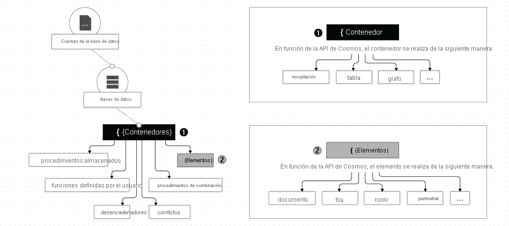
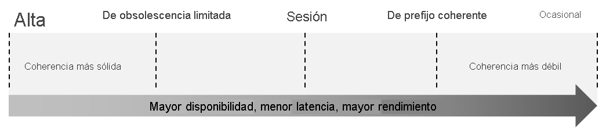
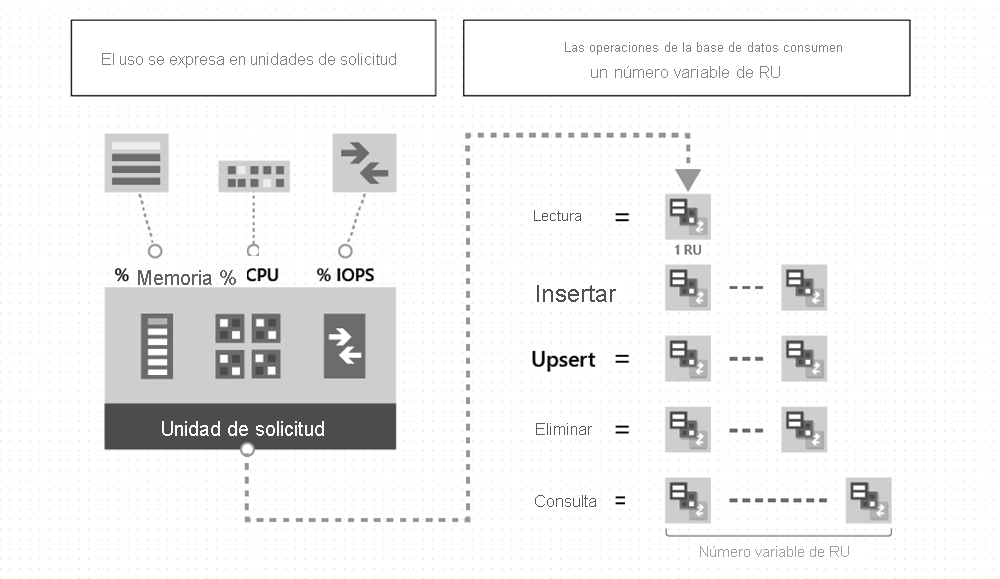

# Module 04: Azure Cosmos DB storage

## Exploración de Azure Cosmos DB

### Identificación de las principales ventajas de Azure Cosmos DB

Base de Datos NoSQL, semi estructurada con replicacion global. Es decir, puedo tener múltiples replicas en diferentes regiones. Diseñada para proporcionar una latencia baja, una escalabilidad elástica del rendimiento

#### Ventajas clave de distribución global
Todas las regiones admiten lecturas y escrituras. La funcionalidad de arquitectura multimaestro también habilita lo siguiente:

- Escalabilidad de escritura y lectura elásticas ilimitada.
- 99,999 % de disponibilidad de lectura y escritura en todo el mundo.
- Garantía de lecturas y escrituras atendidas en menos de 10 milisegundos en el percentil 99.

De manera interna, Azure Cosmos DB controla la replicación de datos entre regiones de una manera que garantiza el nivel de coherencia elegido.

**Consistencia**: se refiere a la consistencia de la información en cada replica. Esto afecta directamente a la performance.

Azure Cosmos DB ofrece cinco niveles bien definidos. De más fuerte a más débil, los niveles son:

- **Fuerte**:  capacidad de servir solicitudes simultáneamente. Se garantiza que las lecturas devuelven la versión más reciente de un elemento. 
- **Uso vinculado**: 
- **Sesión**: as escrituras se replican en un mínimo de tres réplicas (en un conjunto de cuatro réplicas) en la región local, con replicación asincrónica en todas las demás regiones.
- **Prefijo coherente**: la escritura se realiza en lotes separados. Solo al leer el lote en conjunto se obtiene la coherencia completa.
- **Ocasional**: 

**Baja latencia**: tanto para escritura como para lectura, hay  una respuesta menor a los 10ms en el 99% de los casos. 

### Jerarquía de servicio

#### Elementos de una cuenta de Azure Cosmos DB

**Azure Cosmo DB Account**: unidad fundamental de distribución global y alta disponibilidad, puede agregar y quitar regiones de Azure en su cuenta en cualquier momento.En Azure Cosmos DB, un contenedor es la unidad fundamental de escalabilidad. Realiza particiones de forma transparente en el contenedor mediante la clave de partición lógica que especifique para escalar elásticamente el rendimiento y el almacenamiento aprovisionados.

En la siguiente imagen se muestra la jerarquía de diferentes entidades en una cuenta de Azure Cosmos DB:

**Azure Cosmos DB database**: Una base de datos es análoga a un espacio de nombres. Una base de datos es la unidad de administración de un conjunto de contenedores.

**Azure Cosmos DB containers**: Permite la creacion de tablas, Store Procedures, funciones definidas por el usuario, triggers. Es la unidad de escalabilidad del rendimiento y almacenamiento aprovisionados. Un contenedor se divide de forma horizontal y luego se replica en varias regiones.

Al crear un contenedor, debe configurar el rendimiento de uno de los siguientes modos:

- **Modo de rendimiento aprovisionado dedicado:** el rendimiento aprovisionado en un contenedor está reservado exclusivamente para ese contenedor y lo respaldan los Acuerdos de Nivel de Servicio.
- **Modo de rendimiento aprovisionado compartido:** estos contenedores comparten el rendimiento aprovisionado con los demás contenedores de la misma base de datos (excepto aquellos contenedores que han sido configurados con un rendimiento aprovisionado dedicado). En otras palabras, el rendimiento aprovisionado en la base de datos se comparte entre todos los contenedores de "rendimiento compartidos".

**Azure Cosmos DB items**:  En función de la API que use, un elemento de Azure Cosmos DB puede representar un documento de una colección, una fila de una tabla, o un nodo o un borde de un grafo. Se refiere a los registros(document, row, node, edge).

### Exploración de los niveles de coherencia

La coherencia fuerte y la posible coherencia están en los extremos del espectro, pero existen muchas opciones de coherencia en todo el espectro. Los desarrolladores pueden usar estas opciones para elegir opciones precisas y compensaciones pormenorizadas con respecto a la alta disponibilidad y al rendimiento.

Azure Cosmos DB ofrece cinco niveles bien definidos. De más fuerte a más débil, los niveles son:

- Alta
- Uso vinculado
- Sesión
- Prefijo coherente
- Ocasional

Cada nivel proporciona equilibrio entre la disponibilidad y el rendimiento. En la imagen siguiente se muestran los distintos niveles de coherencia como un espectro.

## Selección del nivel de coherencia adecuado

Cada uno de los modelos de coherencia se puede usar para escenarios reales específicos. Cada uno de ellos proporciona una disponibilidad y un rendimiento precisos, y están respaldados por acuerdos de nivel de servicio completos.

### Configuración del nivel de coherencia predeterminado

se aplica a todas las bases de datos y contenedores de Azure Cosmos DB de esa cuenta. Todas las operaciones de lectura y consulta que se emitan con arreglo a un contenedor o una base de datos usan el nivel de coherencia especificado de forma predeterminada.
La coherencia de lectura se aplica a una sola operación de lectura limitada a una partición lógica. Un cliente remoto o un procedimiento almacenado pueden emitir la operación de lectura.

### Garantías asociadas a los niveles de coherencia
Azure Cosmos DB garantiza que el 100 por ciento de las solicitudes de lectura cumplan con la garantía de coherencia del nivel de coherencia que elija. Las definiciones precisas de los cinco niveles de coherencia de Azure Cosmos DB que usan el lenguaje de especificación TLA+ se proporcionan en el repositorio azure-cosmos-tla de GitHub.

### Coherencia fuerte

La coherencia fuerte ofrece una garantía de linearización. La linearización hace referencia a la capacidad de servir solicitudes simultáneamente. Se garantiza que las lecturas devuelven la versión más reciente de un elemento. Un cliente nunca ve una escritura no confirmada ni parcial. Se garantiza que los usuarios siempre leerán la escritura confirmada más reciente.

### Coherencia de obsolescencia limitada

En la obsolescencia limitada se garantiza que las lecturas respetan la garantía de prefijo coherente. Las lecturas pueden ir con retraso respecto a las escrituras en un máximo de versiones "K" (es decir, "actualizaciones") de un elemento o en el intervalo de tiempo "T" , lo que se lea primero. 

En otras palabras, cuando elige la obsolescencia limitada, la "obsolescencia" se puede configurar de dos maneras:

- El número de versiones (K) del elemento
- El intervalo de tiempo (T) que las lecturas pueden retrasarse con respecto a las escrituras

En el caso de una cuenta de una sola región, el valor mínimo de K y T es de 10 operaciones de escritura o de 5 segundos. En el caso de cuentas de varias regiones, el valor mínimo de K y T es de 100 000 operaciones de escritura o de 300 segundos.

### Coherencia de sesión

En la coherencia de sesión, en una sesión de cliente individual, se garantiza que las lecturas respetan las garantías de prefijo coherente, lecturas monotónicas, escrituras monotónicas, lectura de la escritura y escritura tras las lecturas. Esto da por hecho una sesión de "escritor" individual o el uso compartido del token de sesión para varios escritores.

### Coherencia de prefijo coherente

En prefijo coherente, las actualizaciones hechas como escrituras de documentos únicos ven la coherencia final. Novedades hechas como un lote dentro de una transacción, se devuelven coherentes con la transacción en la que se confirmaron. Las operaciones de escritura dentro de una transacción de varios documentos siempre están visibles juntas.

Supongamos que se realizan dos operaciones de escritura en los documentos T1 y T2, dentro de las transacciones T1 y T2. Cuando el cliente realiza una lectura en cualquier réplica, el usuario ve "Doc 1 v1 y Doc 2 v1" o "Doc 1 v2 y Doc 2 v2", pero nunca "Doc 1 v1 y Doc 2 v2" o "Doc 1 v2 y Doc 2 v1" en la misma operación de lectura o consulta.

### Coherencia final

En la coherencia final, no hay ninguna garantía de ordenación para las lecturas. En ausencia de escrituras adicionales, las réplicas terminarán por converger.
La coherencia final es la forma más débil de coherencia, ya que un cliente puede leer los valores que son más antiguos que los que había leído antes. La coherencia final es ideal cuando la aplicación no requiere ninguna garantía de ordenación. Algunos ejemplos son el recuento de retweets, el número de Me gusta o comentarios no encadenados.

### API para Cosmos DB

Azure Cosmos DB ofrece varias API de base de datos, entre las que se incluyen las siguientes:

- **Azure Cosmos DB para NoSQL** almacena datos en formato de documento, permiten realizar consultas mediante la sintaxis del Lenguaje de consulta estructurado (SQL).
- **Azure Cosmos DB for MongoDB** almacena los datos en una estructura de documentos a través del formato BSON.
- **Azure Cosmos DB para PostgreSQL** Almacena datos en un único nodo o distribuidos en una configuración de varios nodos.
- **Azure Cosmos DB for Apache Cassandra** almacena los datos en el esquema orientado a columnas, escalado horizontal y altamente distribuido para almacenar grandes volúmenes de datos
- **Azure Cosmos DB for Table** almacena datos en formato clave-valor.
- **Azure Cosmos DB for Apache Gremlin** permite a los usuarios realizar consultas de grafos y almacenar datos como bordes y vértices.

## Detección de las unidades de solicitud

Con Azure Cosmos DB, paga por el rendimiento que aprovisiona y el almacenamiento que consume cada hora. Se debe aprovisionar el rendimiento para garantizar que siempre haya suficientes recursos del sistema disponibles para la base de datos de Azure Cosmos.

### Unidades de solicitud (Request Units [RU])
Azure Cosmos DB normaliza el costo de todas las operaciones de base de datos y este se expresa en unidades de solicitud (o RU, para abreviar). Una unidad de solicitud representa los recursos del sistema, como CPU e IOPS, y la memoria que se necesitan para realizar las operaciones de base de datos

En la siguiente imagen se muestra el concepto de unidades de solicitud a grandes rasgos:

El tipo de cuenta de Azure Cosmos DB que usa determina el modo en que se cobrarán las RU consumidas.

Hay tres modos en los que se puede crear una cuenta:

- **Modo de rendimiento aprovisionado**:se realiza por segundos en incrementos de 100 RU/segundo. Para escalar el rendimiento aprovisionado para la aplicación, puede aumentar o disminuir el número de RU en cualquier momento, en incrementos o decrementos de 100 RU.
- **Modo sin servidor**: no es necesario aprovisionar rendimiento al crear recursos, factura el número de unidades de solicitud consumidas por las operaciones de base de datos.
- **Modo de escalabilidad automática**: puede escalar de forma automática e instantánea el rendimiento (RU/s) de la base de datos o del contenedor en función de su uso. Adecuado para cargas de trabajo críticas que tienen patrones de tráfico variables o imprevisibles y requieren SLA para el alto rendimiento y la escala.

[Creación de CosmosDB Account + DB + Container + Item](./Resource/Module04/CreateCosmosDBforNoSQL.mkv)

https://learn.microsoft.com/es-es/training/modules/explore-azure-cosmos-db/8-create-cosmos-db-resources-portal